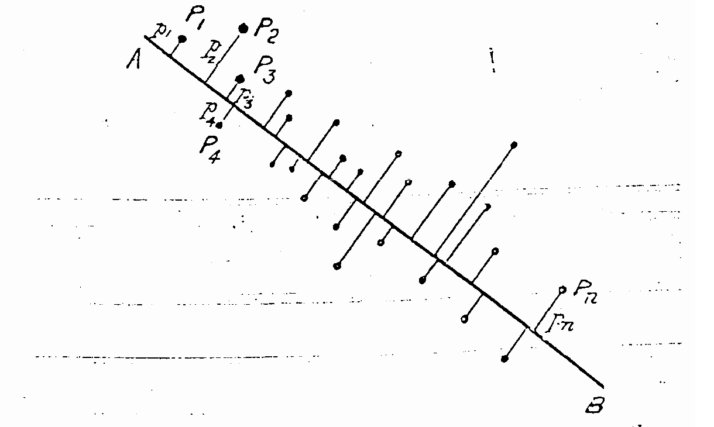

## 100 stocks, one market?

On most days in 2020, you could open the financial news and read that "the market" did something — up 2%, down 4%, recovering. But there is no such thing as "the market." There are individual stocks: Apple, JPMorgan, ExxonMobil, Coca-Cola. Each has its own customers, its own earnings, its own story. So why does the news talk as if there is one number?

Because on most days, they really do move together. The next plot shows five hand-picked S&P 100 names — a tech giant, a megabank, an energy major, a consumer staple, and a software company — over 2020 (of the 100 names, 95 survive our data-quality filter). Watch what happens in mid-March.

```{python}
import numpy as np
import pandas as pd
import matplotlib.pyplot as plt
import seaborn as sns
import warnings
warnings.filterwarnings('ignore')
sns.set_style('whitegrid')
plt.rcParams['figure.figsize'] = (8, 4.5)
plt.rcParams['font.size'] = 12
np.random.seed(42)

from sklearn.decomposition import PCA
from sklearn.preprocessing import StandardScaler

DATA_DIR = 'data'

returns = pd.read_csv(
    f'{DATA_DIR}/stocks/sp100_daily_returns_2014_2024.csv',
    index_col=0, parse_dates=True,
)
metadata = pd.read_csv(f'{DATA_DIR}/stocks/sp100_metadata.csv')

hook_tickers = ['AAPL', 'JPM', 'XOM', 'KO', 'MSFT']
cumret_2020 = (1 + returns.loc['2020', hook_tickers]).cumprod()
cumret_2020 = cumret_2020 / cumret_2020.iloc[0]

fig, ax = plt.subplots(figsize=(8, 4.5))
for tkr in hook_tickers:
    ax.plot(cumret_2020.index, cumret_2020[tkr], label=tkr, linewidth=1.5)
ax.axvline(pd.Timestamp('2020-03-16'), color='red', linestyle='--', alpha=0.4,
           label='COVID shutdown')
ax.set_ylabel('Cumulative return (Jan 2020 = 1)')
ax.set_title('Five S&P 100 stocks across 2020')
ax.legend(loc='lower right', ncol=2)
plt.tight_layout()
plt.show()
```

For most of January and February the lines drift independently. Then in mid-March they all crash together. By summer they diverge again — tech runs up, energy lags, the bank rebounds slowly. **One hundred stocks have one hundred stories, but on most days the market moves them in lockstep.** How many *real* dimensions of variation are there in this dataset? **Principal component analysis (PCA)** gives a quantitative answer. It belongs to a family of methods called **dimensionality reduction**: replace $p$ original features with $k \ll p$ new ones, chosen to preserve as much structure as possible.

## The picture behind PCA

Long before computers, Karl Pearson described PCA geometrically. In 1901 he asked: given a cloud of points in the plane, what *line* minimizes the sum of *squared* perpendicular distances from points to the line? He answered the question in any number of dimensions, with no eigenvalues and no matrix factorizations — just elementary geometry (Pearson, "On Lines and Planes of Closest Fit to Systems of Points in Space," Philosophical Magazine, 1901).

{width=70% fig-align="center"}

Here is the same picture, drawn with real data. Each point is one trading day's pair of returns for JPMorgan and Bank of America — two big U.S. banks. They aren't identical, but they track each other: when banks have a good day, both rise.

```{python}
pair_raw = returns[['JPM', 'BAC']]
pair = pair_raw.dropna() * 100  # convert to %
n_dropped = len(pair_raw) - len(pair)
print(f"Dropped {n_dropped} rows missing JPM or BAC")
jpm = pair['JPM'].values
bac = pair['BAC'].values

# Centered for PCA
jpm_centered = jpm - jpm.mean()
bac_centered = bac - bac.mean()
M = np.column_stack([jpm_centered, bac_centered])
_, S, Vt = np.linalg.svd(M, full_matrices=False)
pc1, pc2 = Vt[0], Vt[1]
scale = 1.8 * S[0] / np.sqrt(len(M))

fig, ax = plt.subplots(figsize=(6, 6))
ax.scatter(jpm, bac, s=4, alpha=0.25, color='steelblue')
ax.set_xlabel('JPM daily return (%)')
ax.set_ylabel('BAC daily return (%)')
ax.set_title(f'JPM vs BAC daily returns, 2014--2024  (corr = {np.corrcoef(jpm, bac)[0,1]:.2f})')

# PC1 / PC2 axes through the mean
mx, my = jpm.mean(), bac.mean()
ax.plot([mx - scale*pc1[0], mx + scale*pc1[0]],
        [my - scale*pc1[1], my + scale*pc1[1]],
        color='darkorange', linewidth=2.5, label='PC1')
ax.plot([mx - 0.6*scale*pc2[0], mx + 0.6*scale*pc2[0]],
        [my - 0.6*scale*pc2[1], my + 0.6*scale*pc2[1]],
        color='green', linewidth=2.5, label='PC2')

# Example point + its perpendicular projection onto PC1
ex = np.array([6.0, 3.0])
proj_scalar = (ex - np.array([mx, my])) @ pc1
proj_point = np.array([mx, my]) + proj_scalar * pc1
ax.plot([ex[0], proj_point[0]], [ex[1], proj_point[1]],
        color='red', linewidth=1.2, linestyle=':')
ax.scatter([ex[0]], [ex[1]], s=60, color='red', zorder=5)
ax.annotate('one day\n(perpendicular\n  projection)', xy=ex, xytext=(7.5, 2.0),
            fontsize=9, color='red')

ax.set_xlim(-15, 15); ax.set_ylim(-15, 15)
ax.set_aspect('equal')
ax.legend(loc='upper left')
plt.tight_layout()
plt.show()
```

The cloud is elliptical. PC1 (orange) is the long axis — the shared up-and-down move of the two banks, the "banking sector" direction. PC2 (green) is the short axis — the small idiosyncratic differences between the two stocks once that common move is removed. The dotted red line shows one day's perpendicular drop onto PC1; its *squared* length is what PCA minimizes, summed over all days.

Before we scale up to 95 stocks, here is PC1 in numbers. With only two features the whole computation fits in a few lines: form the 2×2 sample covariance matrix, take its top eigenvalue and eigenvector, project one day onto that direction.

```{python}
# (1) 2x2 sample covariance of the centered pair.
C = np.cov(jpm_centered, bac_centered, ddof=1)

# (2) Eigendecomposition; sort so the largest eigenvalue is first.
eigvals, eigvecs = np.linalg.eigh(C)
order = np.argsort(eigvals)[::-1]
eigvals, eigvecs = eigvals[order], eigvecs[:, order]

# (3) PC1 direction = top eigenvector; PC variances = eigenvalues.
v1 = eigvecs[:, 0]
print(f"PC1 direction       : ({v1[0]:+.3f}, {v1[1]:+.3f})")
print(f"PC1 variance share  : {eigvals[0] / eigvals.sum() * 100:.1f}%")
print(f"PC2 variance share  : {eigvals[1] / eigvals.sum() * 100:.1f}%")

# (4) Project the example day from the figure (JPM +6%, BAC +3%) onto PC1.
day = np.array([6.0, 3.0])
mean_xy = np.array([jpm.mean(), bac.mean()])
score = (day - mean_xy) @ v1
print(f"Example day score on PC1: {score:+.2f}")
```

Two banks, two PCs. PC1 points northeast at nearly equal weight on JPM and BAC — the banking-sector direction in numbers — and carries the bulk of the variance. PC2 picks up what's left, the idiosyncratic axis. The example day (JPM +6%, BAC +3%) sits far out along PC1: most of the move is sector, only a sliver is BAC-vs-JPM idiosyncratic. Scaling to 95 stocks does not change the recipe, only the size of the matrix.

This is the picture behind every PCA. Each data point is a vector in $\mathbb{R}^p$ — one number per feature. PC1 is the unit direction $v \in \mathbb{R}^p$ that maximizes the variance of projected points; equivalently (by Pythagoras), the direction that minimizes the total squared perpendicular distance from the data to the line through the mean with direction $v$. PC2 is the next-best direction orthogonal to PC1, PC3 the next-best orthogonal to both, and so on.

In two dimensions you can see it. In ninety-five you cannot — but the optimization is the same.

## Loading the returns data

Each row of the dataset is one trading day; each column is one stock; each entry is that stock's **daily log return** for that day. Log returns are convenient because they add across time: a 1% log return today and a 2% log return tomorrow combine to a 3% log return over two days. For small daily moves they are also nearly indistinguishable from simple percent returns.

:::{.callout-important}
## Definition: Daily log return
For a stock with adjusted close price $P_t$ on day $t$, the daily log return is

$$r_t = \log(P_t / P_{t-1}) = \log P_t - \log P_{t-1}.$$

Adjusted close means dividends and stock splits have been folded in, so the price reflects total return to a buy-and-hold investor.
:::

```{python}
print(f"Returns matrix shape: {returns.shape[0]:,} days x {returns.shape[1]} stocks")
print(f"Date range: {returns.index.min().date()} to {returns.index.max().date()}")
print(f"Tickers (first 10): {list(returns.columns[:10])}")
```

Eleven years of daily returns, 95 stocks.

## First attempt: PCA without standardization

Stocks have very different volatilities. Tesla can move 5% in a day; Coca-Cola rarely moves more than 1%. What happens if we run PCA directly on the raw returns?

:::{.callout-tip}
## Think About It
Before reading on — which stocks do you expect to dominate PC1 when we skip standardization?
:::

```{python}
pca_raw = PCA()
pca_raw.fit(returns.values)
loadings_raw_pc1 = pd.Series(pca_raw.components_[0], index=returns.columns)
# Sign of a PC is arbitrary; fix it so the average loading is positive
# (PC1 identifies the common-direction axis when one dominates -- as for
#  equity returns; we want positive = "up together").
if loadings_raw_pc1.mean() < 0:
    loadings_raw_pc1 = -loadings_raw_pc1

print(f"PC1 (no standardization) — explains {pca_raw.explained_variance_ratio_[0]*100:.1f}% of variance")
print(f"  positive loadings: {(loadings_raw_pc1 > 0).sum()} / {len(loadings_raw_pc1)} stocks")
top5_sqshare_raw = (loadings_raw_pc1**2).nlargest(5).sum()
print(f"  squared-loading mass in top 5 stocks: {top5_sqshare_raw*100:.1f}% (uniform = {5/len(loadings_raw_pc1)*100:.1f}%)")
print()
print("Top 5 stocks by |PC1 loading| (with signs):")
print(loadings_raw_pc1.loc[loadings_raw_pc1.abs().nlargest(5).index].round(3))
```

PC1 already loads positively on every stock — there is a common up/down direction in the data even without standardization. But the loading *magnitudes* are uneven: the five most volatile names hold roughly 12% of PC1's squared mass — more than 2× their uniform-baseline share of about 5.3% (5/95). After we standardize in the next section, that top-5 share drops to about 8.5%, much closer to the baseline. PC1 is shaped more by "TSLA and the other big movers" than by the average company.

:::{.callout-warning}
## PCA is dominated by scale
Without standardization, PCA finds whichever features have the biggest variance, not whichever features carry the most structure.
:::

## The fix: standardize first

To put every stock on equal footing we **standardize**: subtract each stock's mean return and divide by its standard deviation (the **z-score** transformation). Now every stock has mean 0 and variance 1, and PCA finds structure in the *correlations*, not the *magnitudes*.

In matrix terms, PCA on raw centered data decomposes the **covariance matrix**; PCA on standardized data decomposes the **correlation matrix**.[^corrcov] For returns, the correlation matrix is almost always what we want.

[^corrcov]: When each column of $Z$ has mean 0 and variance 1, $Z^\top Z/(n-1)$ has 1's on the diagonal and the correlations of the original columns off-diagonal — i.e., it equals the correlation matrix of $X$.

```{python}
scaler = StandardScaler()
Z = scaler.fit_transform(returns.values)
pca = PCA()
pca.fit(Z)

loadings_pc1 = pd.Series(pca.components_[0], index=returns.columns)
if loadings_pc1.mean() < 0:
    loadings_pc1 = -loadings_pc1

print(f"PC1 (standardized) — explains {pca.explained_variance_ratio_[0]*100:.1f}% of variance")
print(f"  positive loadings: {(loadings_pc1 > 0).sum()} / {len(loadings_pc1)} stocks")
top5_sqshare = (loadings_pc1**2).nlargest(5).sum()
print(f"  squared-loading mass in top 5 stocks: {top5_sqshare*100:.1f}% (uniform = {5/len(loadings_pc1)*100:.1f}%)")
print()
print("Top 5 stocks by |PC1 loading| (with signs):")
print(loadings_pc1.loc[loadings_pc1.abs().nlargest(5).index].round(3))
print()
print(f"PC2: {pca.explained_variance_ratio_[1]*100:.1f}% of variance")
print(f"PC3: {pca.explained_variance_ratio_[2]*100:.1f}% of variance")
```

The sign pattern hasn't changed — every loading is still positive — but the magnitudes have evened out: the top-5 concentration drops, every stock contributes nearly equally. **PC1 now traces the market factor**, no longer biased toward the high-volatility names. The factor was always there; raw-scale PCA tilted it toward whichever stocks had the largest raw variance.

The contrast is sharpest in a picture: sorted PC1 loadings, raw on the left, standardized on the right.

```{python}
fig, axes = plt.subplots(1, 2, figsize=(11, 4), sharey=False)

axes[0].bar(range(len(loadings_raw_pc1)),
            sorted(loadings_raw_pc1.values, reverse=True),
            color='indianred', edgecolor='white', linewidth=0.3)
axes[0].axhline(0, color='black', linewidth=0.5)
axes[0].set_title('PC1 loadings — raw returns')
axes[0].set_xlabel('Stock (sorted by loading)')
axes[0].set_ylabel('Loading')

axes[1].bar(range(len(loadings_pc1)),
            sorted(loadings_pc1.values, reverse=True),
            color='steelblue', edgecolor='white', linewidth=0.3)
axes[1].axhline(0, color='black', linewidth=0.5)
axes[1].set_title('PC1 loadings — standardized returns')
axes[1].set_xlabel('Stock (sorted by loading)')

plt.tight_layout()
plt.show()
```

The left panel has a steep nose and a long flat tail — a few stocks dominate. The right panel is a broad, uniformly positive bar — every stock contributes. Same data, same algorithm, different scale.

## The scree plot

A **scree plot** shows the fraction of total variance captured by each principal component — its **explained variance ratio**. The shape tells us how the structure decomposes.

```{python}
fig, axes = plt.subplots(1, 2, figsize=(11, 4))
ratios = pca.explained_variance_ratio_ * 100

axes[0].bar(range(1, 21), ratios[:20], color='steelblue', edgecolor='white')
axes[0].set_xlabel('Principal component')
axes[0].set_ylabel('Variance explained (%)')
axes[0].set_title('Scree plot (first 20 PCs)')

cumvar = np.cumsum(ratios)
axes[1].plot(range(1, 51), cumvar[:50], 'o-', color='steelblue', markersize=4)
axes[1].axhline(70, color='red', linestyle='--', alpha=0.5, label='70%')
axes[1].axhline(80, color='orange', linestyle='--', alpha=0.5, label='80%')
axes[1].set_xlabel('Number of components')
axes[1].set_ylabel('Cumulative variance explained (%)')
axes[1].set_title('Cumulative variance')
axes[1].legend()

plt.tight_layout()
plt.show()

for threshold in (50, 70, 80, 90):
    k = int(np.argmax(cumvar >= threshold)) + 1
    print(f"  {threshold}% variance: need {k} PCs (of {len(ratios)})")
```

PC1 dominates: a sharp drop from PC1 to PC2, then a long, gradual tail. A naive elbow read would pick $k=1$ — but as we'll see in the payoff section below, cross-validation prefers $k=3$. *Interpretability is not validation.* In finance this is the typical shape: one large factor (the market), a handful of mid-sized factors (sectors, styles), and a long tail of idiosyncratic structure.

Why do the two procedures disagree? They optimize different objectives. The scree elbow ranks PCs by their variance in the *training* covariance — and PC1 swamps the others. Cross-validation ranks them by *held-out* portfolio variance, which depends on how well $\hat\Sigma_k$ estimates the true covariance on data we did not fit. PC2 and PC3 add little to total variance, but they stabilize the covariance estimate against the noise in the long flat tail — noise that, left in, blows up out-of-sample portfolio variance. Different objectives, different answers.

:::{.callout-important}
## Definition: Elbow method
The **elbow method** is a rough rule for choosing the number of components $k$ from a scree plot: keep components up to the point where the bar heights stop dropping quickly — the bend, or "elbow," in the plot. Components before the elbow capture meaningful structure; components after it look like noise. The elbow is a guide, not a prescription. On real data it can mislead: even a textbook-sharp elbow (like the one above) does not always pick the $k$ that performs best on a downstream task. The principled alternative is to choose $k$ by cross-validation against the downstream task — which is what we do in the payoff section below.
:::

## Interpreting the principal components

Each PC is a vector of weights, one per stock — the **loadings**. We can read off what each component "means" by looking at which stocks have the biggest loadings.

:::{.callout-note}
## Terminology: components, loadings, scores
The PC basis vectors are the **principal components** (sklearn: `.components_`). Their entries — one per input feature — are the **loadings**. Each data point's coordinates in the PC basis are the **PC scores** (sklearn: `.transform(X)`). Some textbooks scale loadings by $\sqrt{\lambda_i}$; we use the unscaled convention throughout.
:::

```{python}
loadings = pd.DataFrame(
    pca.components_[:3].T,
    index=returns.columns,
    columns=['PC1', 'PC2', 'PC3'],
)

# Bar chart of PC1 and PC2 loadings, sorted by PC1; PC2 colored by sector
loadings_sector = loadings.join(metadata.set_index('ticker')[['sector']])
sectors_unique = sorted(loadings_sector['sector'].dropna().unique())
palette = sns.color_palette('tab10', n_colors=len(sectors_unique))
sector_color = dict(zip(sectors_unique, palette))

fig, axes = plt.subplots(2, 1, figsize=(8, 6), sharex=True)

order = loadings['PC1'].sort_values(ascending=False).index
axes[0].bar(range(len(order)), loadings.loc[order, 'PC1'],
            color='steelblue', edgecolor='white', linewidth=0.3)
axes[0].axhline(0, color='black', linewidth=0.5)
axes[0].set_ylabel('PC1 loading')
axes[0].set_title('PC1 loadings — sorted (the market factor)')

pc2_colors = [sector_color.get(loadings_sector.loc[t, 'sector'], 'gray') for t in order]
axes[1].bar(range(len(order)), loadings.loc[order, 'PC2'],
            color=pc2_colors, edgecolor='white', linewidth=0.3)
axes[1].axhline(0, color='black', linewidth=0.5)
axes[1].set_ylabel('PC2 loading')
axes[1].set_xlabel('Stock (sorted by PC1 loading)')
axes[1].set_title('PC2 loadings — colored by GICS sector')

# Compact sector legend below the plot
from matplotlib.patches import Patch
handles = [Patch(facecolor=sector_color[s], label=s) for s in sectors_unique]
axes[1].legend(handles=handles, loc='lower center', bbox_to_anchor=(0.5, -0.55),
               ncol=4, fontsize=7, frameon=False)

plt.tight_layout()
plt.show()
```

**PC1 is the market factor.** Every loading is positive (or essentially so). A stock's PC1 loading is its sensitivity to the market: a stock with a large PC1 loading swings hard when the index swings; a stock with a small PC1 loading is a defensive name.

**PC2 splits the universe into two camps.** Look first at the stocks with the largest positive and negative PC2 loadings, together with their sectors:

```{python}
loadings_named = loadings.join(metadata.set_index('ticker')[['sector']])
print("PC2 — top 8 positive loadings:")
print(loadings_named.nlargest(8, 'PC2')[['PC2', 'sector']].round(2))
print()
print("PC2 — top 8 negative loadings:")
print(loadings_named.nsmallest(8, 'PC2')[['PC2', 'sector']].round(2))
```

The two extremes already suggest a sector pattern. Averaging within each sector confirms it:

```{python}
print("\nPC2 average loading by sector:")
print(loadings_named.groupby('sector')['PC2'].mean().sort_values().round(3))
```

The pattern is sharp. One side: Financials and Energy — JPMorgan, Bank of America, Wells Fargo, Citi, Capital One; Energy slightly edges Financials on the sector mean. The other: Consumer Staples and Utilities — Procter & Gamble, Colgate, Pepsi, NextEra, Walmart. **PC2 is the cyclical-versus-defensive contrast.** When cyclicals rally on a strong economy, PC2 is up; when investors pile into staples and utilities for safety, PC2 is down.

PC3 takes more reading. The extremes hint at a different axis:

```{python}
print("PC3 — top 5 positive loadings:")
print(loadings_named.nlargest(5, 'PC3')[['PC3', 'sector']].round(2))
print()
print("PC3 — top 5 negative loadings:")
print(loadings_named.nsmallest(5, 'PC3')[['PC3', 'sector']].round(2))
```

A sector-colored bar chart shows the contrast across the universe:

```{python}
fig, ax = plt.subplots(figsize=(8, 3.5))
pc3_colors = [sector_color.get(loadings_sector.loc[t, 'sector'], 'gray') for t in order]
ax.bar(range(len(order)), loadings.loc[order, 'PC3'],
       color=pc3_colors, edgecolor='white', linewidth=0.3)
ax.axhline(0, color='black', linewidth=0.5)
ax.set_ylabel('PC3 loading')
ax.set_xlabel('Stock (sorted by PC1 loading)')
ax.set_title('PC3 loadings — colored by GICS sector')

handles = [Patch(facecolor=sector_color[s], label=s) for s in sectors_unique]
ax.legend(handles=handles, loc='lower center', bbox_to_anchor=(0.5, -0.75),
          ncol=4, fontsize=7, frameon=False)
plt.tight_layout()
plt.show()
```

PC3 turns out to be the growth-versus-yield contrast: Nvidia, Amazon, Meta, Adobe, Alphabet on one side; utilities (Duke, Southern), staples (Coca-Cola, Altria), and high-dividend telecom (Verizon) on the other. By PC5 or PC6 the economic story runs out.

:::{.callout-tip}
## Think About It
If PC1 looks like the market and PC2 splits cyclicals from defensives — haven't we already proved that PCA "worked"?

Hold that thought. We will revisit it in the payoff section below. *Interpretability is not validation.* The proof that PCA helps comes from a downstream task evaluated on data we never used to fit the components.
:::

## The math behind PCA

In regression (Chapters 4 and 5) we projected $y$ onto a *given* subspace — the column space of the feature matrix $X$ — and measured fit by the squared length of the residual. PCA is the same projection, but now we *choose* the subspace.

Each row $x_i$ of the centered data matrix is a vector in $\mathbb{R}^p$ — one number per feature (one daily return per stock). A **$k$-dimensional subspace** $S \subset \mathbb{R}^p$ is the span of $k$ linearly independent vectors — a **basis** — like the column space from regression. Given any such $S$, the projection $P_S x_i$ is the closest point in $S$ to $x_i$, and the squared distance is $\|x_i - P_S x_i\|^2$.

PCA picks the subspace, not the projection. With $k=1$, $S$ is a line and we recover Pearson's picture: the best line through the cloud. With $k=2$, $S$ is a plane. With general $k$ — say $k=3$ inside $\mathbb{R}^{95}$ for our stocks — $S$ is the best $k$-dim subspace through the $p$-dim cloud. The two-stock figure and the 95-stock problem are the same problem at different $k$ and $p$.

:::{.callout-important}
## Definition: Principal Component Analysis (variational form)
Among all $k$-dimensional subspaces of $\mathbb{R}^p$, PCA picks the one closest to the data: the subspace $S^\star$ minimizing the total squared distance,

$$S^\star = \arg\min_{\dim S = k}\; \sum_{i=1}^n \|x_i - P_S x_i\|^2.$$

Equivalently (by Pythagoras, after centering): the subspace that maximizes the total variance of the projections.
:::

The **principal components** are an **orthonormal basis** for $S^\star$ (unit-length, pairwise orthogonal), ordered so that PC1 is the direction of greatest projected variance, PC2 the next-greatest orthogonal to PC1, and so on. PC1 through PC$k$ together span the optimal $k$-dimensional subspace.

The variational form says *what* PCA solves, not *how*. The **singular value decomposition** (SVD) of the data matrix solves it: $X = U S V^T$, with $V$ holding the principal directions in its columns and $S$ diagonal with nonnegative **singular values** $\sigma_1 \geq \sigma_2 \geq \cdots$. The variance captured by PC$i$ is $\sigma_i^2/(n-1)$ — what sklearn returns in `pca.explained_variance_[i]`. Collecting the top $k$ into a diagonal matrix gives $\Lambda_k = S_k^2/(n-1)$, the matrix of PC variances we will use in the payoff section.

:::{.callout-note collapse="true"}
## Going deeper: SVD construction, optimality, and an iterative alternative

The full SVD: every $n \times p$ matrix $X$ admits a decomposition $X = U S V^T$, where $U \in \mathbb{R}^{n \times r}$ and $V \in \mathbb{R}^{p \times r}$ have orthonormal columns and $S \in \mathbb{R}^{r \times r}$ is diagonal with nonnegative entries $\sigma_1 \geq \sigma_2 \geq \cdots \geq \sigma_r \geq 0$, where $r = \min(n,p)$.

**Notation.** Two distinct objects are conventionally called "sigma" — the diagonal matrix $S$ of singular values, and the covariance matrix $\Sigma$, $\hat\Sigma$ (in the payoff section below). We use $S$ for the first and $\Sigma$ for the second.

**Optimality.** The rank-$k$ truncation $X_k = U_k S_k V_k^T$ is the closest rank-$k$ matrix to $X$ in squared Frobenius error — the **Eckart-Young-Mirsky theorem** (Eckart and Young, 1936, in Frobenius norm; Mirsky, 1960, in every unitarily invariant norm). The truncated SVD is the universal best low-rank approximation. The rows of $U_k S_k$ are the **PC scores**: each row is one data point's coordinates in the new basis (we will call this matrix $F$ in the next section).

**An iterative alternative.** **Alternating least squares** repeatedly refits the factor scores given the loadings, then the loadings given the factor scores. It scales to giant sparse matrices (the Netflix Prize foundation) and adapts to non-quadratic losses; the SVD is faster when it applies.

For deeper treatment see Strang, *Introduction to Linear Algebra* (6th ed.) §7.4, or Hastie, Tibshirani, and Friedman, *The Elements of Statistical Learning* §14.5.
:::

Let's verify the equivalence on our standardized returns: the SVD components should match sklearn's `.components_` (up to a sign per component), and the squared singular values over $n-1$ should match the explained variances.

```{python}
U, S_svd, Vt_svd = np.linalg.svd(Z, full_matrices=False)
n = Z.shape[0]
k = 3
# Directions match up to a sign flip per component.
signs = np.sign((Vt_svd[:k] * pca.components_[:k]).sum(axis=1))
print("max |Vt[:k] - sign * pca.components_[:k]|:",
      np.abs(Vt_svd[:k] * signs[:, None] - pca.components_[:k]).max())
print("max |S^2/(n-1) - pca.explained_variance_| (first k):",
      np.abs(S_svd[:k]**2 / (n - 1) - pca.explained_variance_[:k]).max())
```

The directions agree to numerical precision (up to an arbitrary sign), and the squared singular values divided by $n-1$ match the PC variances. `PCA()` *is* the truncated SVD.

## When does PCA work well?

The variational characterization says PCA finds the *best* $k$-dimensional subspace. It does not say the best $k$-dimensional subspace is any good. PCA pays off when a small $k$ already explains most of the variance — when the data is approximately low-rank.

When should we expect that? When the data is generated by a small number of unobserved drivers — latent factors that govern many observed features (Udell and Townsend, 2019). Stock returns are the textbook case: a market factor, a few sector factors, and idiosyncratic noise. The same pattern shows up in many other domains, and PCA is a workhorse in each:

- **Finance.** Daily returns on a panel of stocks decompose into a few pervasive common factors plus stock-specific noise. PCA estimates the factors directly; this is exactly the application we build out below. (Bai, "Inferential theory for factor models of large dimensions," *Econometrica*, 2003; Stock and Watson, "Forecasting using principal components from a large number of predictors," *JASA*, 2002.)
- **Genomics.** Gene-expression measurements across thousands of genes and many samples are dominated by a handful of biological axes — cell type, disease state, developmental stage. The leading singular vectors of the expression matrix are called **eigengenes** and are widely used to organize and visualize the data. (Alter, Brown, and Botstein, "Singular value decomposition for genome-wide expression data processing and modeling," *PNAS*, 2000.)
- **Computer vision.** Face photographs vary mostly along a small number of geometric and lighting directions. The leading principal components of a face dataset are themselves face-like images called **eigenfaces** — the first widely-used face-recognition feature representation. (Turk and Pentland, "Eigenfaces for recognition," *Journal of Cognitive Neuroscience*, 1991.)
- **Natural language.** Word-by-document count matrices have a few latent "topic" directions. **Latent semantic analysis** uses the truncated SVD to recover them; the idea is alive in modern word-embedding methods, which can be derived as PCA on a shifted point-wise mutual information matrix. (Deerwester et al., "Indexing by latent semantic analysis," *JASIS*, 1990; Levy and Goldberg, "Neural word embedding as implicit matrix factorization," *NeurIPS*, 2014.)
- **Recommender systems.** User-by-item rating matrices are approximately low-rank because users cluster by taste. Matrix-factorization methods derived from PCA powered the Netflix Prize and are still standard. (Koren, Bell, and Volinsky, "Matrix factorization techniques for recommender systems," *IEEE Computer*, 2009.)

If your data is *not* approximately low-rank — every feature independent noise, say — no rank-$k$ approximation will help. PCA still runs; it just has nothing to find. The scree plot tells you which regime you are in: a sharp drop after a few PCs means PCA will help, a flat scree means it will not.

:::{.callout-note collapse="true"}
## Going deeper: when the structure is built into your features

PCA on a panel of European DNA samples reproduces the map of Europe. Novembre et al. ran PCA on ~197,000 SNPs from 1,387 individuals; the first two principal components plotted against each other recover latitude and longitude with $r^2 \approx 0.7$ each, and 50% of individuals can be placed within 310 km of their reported origin (Novembre et al., "Genes mirror geography within Europe," *Nature*, 2008). It is one of the most beautiful PCA figures ever published.

It is also a cautionary tale. Novembre and Stephens proved a generic mathematical result: PCA applied to spatial data with distance-decaying similarity *necessarily* produces gradient and sinusoidal patterns, with no demographic history required (Novembre and Stephens, "Interpreting principal component analyses of spatial population genetic variation," *Nature Genetics*, 2008). The map of Europe was always going to come out — the math made it inevitable given the sampling. François et al. (2010) showed under range-expansion simulations that the leading PC can even orient *perpendicular* to the actual expansion axis.

A PCA figure that reproduces something you already know about the data — a map, a known taxonomy — is not by itself evidence that PCA discovered hidden structure. The structure may be a mathematical artifact of how the features were constructed and how the units were sampled. *Interpretability is not validation*, even when the interpretation is geographic.
:::

## PCA as regression onto optimal covariates

The variational view picks the *subspace*. An equivalent view picks the *coordinates* — and leads directly to factor models.

Both regression and PCA minimize squared residuals — but they measure residuals differently. Two dimensions show the contrast clearest, on the JPM/BAC cloud from the start of the chapter.

```{python}
from sklearn.linear_model import LinearRegression

# Reuse jpm, bac arrays from the JPM/BAC scatter earlier in the chapter.
fig, axes = plt.subplots(1, 2, figsize=(10, 5))

# LEFT — regression of bac on jpm, vertical residuals.
reg = LinearRegression().fit(jpm.reshape(-1, 1), bac)
xs = np.linspace(jpm.min(), jpm.max(), 200)
ys = reg.predict(xs.reshape(-1, 1))
axes[0].scatter(jpm, bac, s=4, alpha=0.2, color='steelblue')
axes[0].plot(xs, ys, color='darkorange', linewidth=2.5)
# A handful of vertical residual segments so the picture stays legible.
idx = np.linspace(0, len(jpm) - 1, 40).astype(int)
for i in idx:
    yhat_i = reg.predict(jpm[i:i+1].reshape(-1, 1))[0]
    axes[0].plot([jpm[i], jpm[i]], [bac[i], yhat_i],
                 color='red', linewidth=0.8, alpha=0.7)
axes[0].set_xlabel('JPM daily return (%)')
axes[0].set_ylabel('BAC daily return (%)')
axes[0].set_title('Regression: vertical residuals minimized')
axes[0].set_xlim(-15, 15); axes[0].set_ylim(-15, 15)
axes[0].set_aspect('equal')

# RIGHT — PCA on the same cloud, perpendicular residuals to PC1.
# pc1, mx, my already defined in the JPM/BAC PCA cell above.
t_min = ((np.array([jpm.min() - mx, bac.min() - my])) @ pc1)
t_max = ((np.array([jpm.max() - mx, bac.max() - my])) @ pc1)
line_xs = np.array([mx + t_min * pc1[0], mx + t_max * pc1[0]])
line_ys = np.array([my + t_min * pc1[1], my + t_max * pc1[1]])
axes[1].scatter(jpm, bac, s=4, alpha=0.2, color='steelblue')
axes[1].plot(line_xs, line_ys, color='darkorange', linewidth=2.5)
for i in idx:
    t = (np.array([jpm[i] - mx, bac[i] - my])) @ pc1
    px, py = mx + t * pc1[0], my + t * pc1[1]
    axes[1].plot([jpm[i], px], [bac[i], py],
                 color='red', linewidth=0.8, alpha=0.7)
axes[1].set_xlabel('JPM daily return (%)')
axes[1].set_ylabel('BAC daily return (%)')
axes[1].set_title('PCA: perpendicular residuals minimized')
axes[1].set_xlim(-15, 15); axes[1].set_ylim(-15, 15)
axes[1].set_aspect('equal')

plt.tight_layout()
plt.show()
```

On the left, residuals drop straight down to the regression line: $y$ is the variable we are predicting, $x$ is given. On the right, residuals drop perpendicular to the principal direction: PCA treats the two variables symmetrically and minimizes *geometric* distance to the line, not vertical distance. Regression fixes the design matrix; PCA picks it.

Once we have the principal directions $V_k$, each data point gets new coordinates in the basis they form — the PC scores. The reconstruction of the data matrix takes the form $X \approx F B^T$, with $F \in \mathbb{R}^{n \times k}$ holding the **factor scores** (one row per data point) and $B \in \mathbb{R}^{p \times k}$ holding the **loadings, or betas** (one row per feature, one column per component). Equivalently, PCA jointly minimizes
$$\|X - F B^T\|_F^2$$
over $F$ and $B$, where $B$ has orthonormal columns. Plain regression fixes the design matrix and solves for the coefficients; PCA picks both — that is what "optimal covariates" means. In SVD terms, $F = U_k S_k$ and $B = V_k$: the factor scores are the rescaled left singular vectors, and the loadings are the right singular vectors.

The names are chosen to match regression intuition. Each row of $F$ is a vector of latent regressors for one observation — like a row of a design matrix, except PCA chose the columns. Each row of $B$ is a vector of regression coefficients for one feature — like a row of $\hat\beta$. We read $B_{j\ell}$ as "feature $j$'s loading on factor $\ell$," or in finance, "stock $j$'s **beta** on factor $\ell$."

Three communities name the same objects three different ways. The table below maps between them.

:::{.callout-tip}
## Notation cheat sheet

| In the PCA factorization | In the SVD ($X = USV^\top$) | In sklearn | In finance |
|---|---|---|---|
| Loadings matrix $B$ ($p \times k$) | $V_k$ (first $k$ columns of $V$) | `pca.components_.T` | Factor "betas" |
| Score matrix $F$ ($n \times k$) | $U_k S_k$ | `pca.transform(X)` (= $Z B$) | Factor returns over time |
| Variance of PC $i$ | $\sigma_i^2 / (n-1)$ | `pca.explained_variance_[i]` | Variance of factor $i$ |
:::

This has a beautiful payoff in finance. Fix the factors to be PC1, PC2, PC3 — three time series — and regress each stock's returns on them: a **three-factor model**. Each stock now has three numbers: its PC1 sensitivity (its **market beta**), its PC2 sensitivity (its cyclical-vs-defensive tilt), and its PC3 sensitivity. Each column of $B$ defines an **eigenportfolio** — a portfolio whose weights are a PC direction; PC1's eigenportfolio is essentially the market. PCA discovered the factors without anyone naming them in advance.

```{python}
# Each stock's PC1 loading * sqrt(lambda_1) equals the regression coefficient
# of its standardized returns on the *unit-variance* PC1 factor. Verify on AAPL.
pc1_scores = Z @ pca.components_[0]  # PC1 factor returns (standardized)
stock = 'AAPL'
i = list(returns.columns).index(stock)
aapl_z = Z[:, i]
# Regress AAPL's standardized returns on the unit-variance version of PC1.
# Since Var(unit-var PC1) = 1, the regression coefficient is just Cov(AAPL_z, PC1_unit).
pc1_unit = pc1_scores / pc1_scores.std()
beta_unit_var = np.cov(aapl_z, pc1_unit)[0, 1]
beta_via_loading = pca.components_[0, i] * np.sqrt(pca.explained_variance_[0])
print(f"AAPL: regression beta against unit-variance PC1 factor = {beta_unit_var:.3f}")
print(f"AAPL: PC1 loading * sqrt(lambda_1)                     = {beta_via_loading:.3f}")
```

The two numbers agree: each stock's PC1 loading times $\sqrt{\lambda_1}$ is the regression coefficient against the unit-variance PC1 factor. **The loadings table is a betas table.**

## The payoff: portfolios in the $p > n$ regime

**Why minimize variance — shouldn't we just maximize *return*?** Two portfolios with the same average return don't earn the same dollars. A portfolio that loses 50% one year and gains 50% the next finishes *down 25%*, not flat: compounding punishes losses more than gains. Cutting volatility while holding return constant grows real wealth over time — which is why low-volatility ETFs and pension-fund mandates are mainstays of the industry. (The full Markowitz problem trades off return *and* variance; we focus on the variance side because that's where covariance estimation — and PCA — bites.)

A portfolio manager wants to combine the 95 stocks into a portfolio whose weights $w$ minimize variance,

$$\mathrm{Var}(r_{\text{portfolio}}) = w^T \Sigma w, \qquad \sum_i w_i = 1.$$

This is the **Markowitz (1952) minimum-variance portfolio**, with closed form

$$w_{\text{min-var}} \propto \Sigma^{-1} \mathbf{1}$$

— each stock's weight is proportional to its row sum in the inverse covariance matrix. Low-variance stocks and stocks that hedge other names (negative covariances) get larger weights; volatile or strongly correlated stocks get smaller ones.

So we need $\Sigma$ — and to *invert* it. In practice, $\Sigma$ comes from a recent window of historical returns.

:::{.callout-warning}
## The failure mode: $p > n$
Estimate $\Sigma$ from a 60-day rolling window with 95 stocks: $p = 95$, $n = 60$. The 95-by-95 sample covariance matrix has rank at most $n-1 = 59$ (centering uses one degree of freedom) — it is **singular**. Its inverse does not exist. Even with a small ridge term to make it invertible, the resulting portfolio weights are enormous and unstable; a one-day shift in the estimation window produces a wildly different portfolio.

This is the everyday reality of high-dimensional finance: there are always more stocks than recent days. The math we were taught for $\Sigma^{-1}$ does not apply.
:::

PCA gives us a way out. We approximate $\Sigma$ as a **factor model**: a few dominant factor directions plus diagonal idiosyncratic noise.

$$\hat\Sigma_k = V_k \Lambda_k V_k^T + \mathrm{diag}(D)$$

Here $V_k$ holds the top $k$ PC directions, $\Lambda_k$ is the diagonal matrix of corresponding eigenvalues ($\Lambda_k = S_k^2/(n-1)$ in SVD terms), and $D$ is a diagonal correction so that each diagonal of $\hat\Sigma_k$ matches the sample variance of that stock. The diagonal correction makes $\hat\Sigma_k$ positive definite (every eigenvalue is bounded below by the smallest entry of the diagonal correction), so $\hat\Sigma_k^{-1}$ exists and plugs cleanly into the portfolio formula.

We compare four estimates of $\Sigma$. The first two — equal-weight and ridge — are the standard competitors. We add a third to test whether PCA is finding *structure* or whether any low-rank projection would do: replace the principal directions with random orthonormal directions and rerun the same pipeline. If PCA isn't finding signal, the random projection should perform comparably.

1. **Equal-weight.** $w = \mathbf{1}/p$. No covariance estimation at all. The non-trivial competitor.
2. **Sample covariance + ridge.** Use the sample covariance with a small ridge added to make it invertible.
3. **Random-projection factor model.** Same recipe as PCA, but with $V_k$ replaced by a random Gaussian matrix. Tests whether PCA's variance-aligned directions matter or whether any low-rank approximation works.
4. **PCA factor model.** $\hat\Sigma_k$ from the formula above, with $k$ chosen by cross-validation.

### Building the backtest

**Skip-the-code summary.** Estimate covariance four ways on a rolling 60-day training window, form each one's minimum-variance portfolio, hold for the next 21 days, compare realized variances. The PCA factor model wins.

:::{.callout-tip title="Think about it"}
We have 60 days of training data and want to evaluate four covariance estimators. Why not just use random 5-fold cross-validation across the 60 days?

::: {.callout-note collapse="true" title="Reveal"}
Returns are correlated across time — volatility clusters, market regimes persist. If a random fold puts March 15 in training and March 14 + March 16 in validation, we've trained on a day flanked by days we'll be tested on. The validation set isn't independent of the training set, so the random-fold validation error underestimates true generalization error. **Walk-forward evaluation** — train on the past, evaluate on the strictly future — is the time-series analog of train/test: train on the first $n_{\text{train}}$ observations, evaluate on the next $n_{\text{val}}$, then slide forward. We'll develop this properly in Chapter 16; here we use it because we need an honest estimate of held-out portfolio variance.
:::
:::

```{python}
RETURNS = returns.values
DATES = returns.index
N_DAYS, P = RETURNS.shape
ones = np.ones(P)
WINDOW = 60
HOLD = 21  # ~ one month between rebalances


def min_var_weights(Sigma):
    w = np.linalg.solve(Sigma, ones)
    return w / w.sum()


def realized_variance(weights, R_hold):
    return float((R_hold @ weights).var(ddof=0))


def pca_factor_cov(R_train, k):
    """Rank-k PCA factor covariance with diagonal residual correction."""
    # (a) PCA on standardized training returns.
    mu = R_train.mean(0)
    sd = R_train.std(0)
    Zt = (R_train - mu) / sd
    _, s, Vt = np.linalg.svd(Zt, full_matrices=False)
    n = Zt.shape[0]
    eigs = s**2 / (n - 1)
    # (b) Low-rank correlation estimate from the top-k factors: V_k Lambda_k V_k^T.
    Vk = Vt[:k].T
    Lk = np.diag(eigs[:k])
    fit = Vk @ Lk @ Vk.T
    # (c) Diagonal correction: add residual variances so each diagonal entry is 1
    #     (the variance of a standardized stock). Floor at 1e-6 keeps the result
    #     positive definite even if the top-k factors already explain a stock's
    #     variance exactly.
    resid = np.maximum(np.diag(np.eye(P) - fit), 1e-6)
    corr_hat = fit + np.diag(resid)
    # (d) Rescale correlation back to covariance using the stock standard deviations.
    D = np.diag(sd)
    return D @ corr_hat @ D


def ridge_sample_cov(R_train, lam=1e-5):
    return np.cov(R_train, rowvar=False) + lam * np.eye(P)


def random_projection_cov(R_train, k, rng):
    mu = R_train.mean(0)
    sd = R_train.std(0)
    Zt = (R_train - mu) / sd
    G = rng.standard_normal((P, k))
    # Orthonormalize so it's a fair comparison (QR removes any input scale).
    Q, _ = np.linalg.qr(G)
    proj_scores = Zt @ Q
    eigs_rp = proj_scores.var(axis=0, ddof=1)
    fit = Q @ np.diag(eigs_rp) @ Q.T
    resid = np.maximum(np.diag(np.eye(P) - fit), 1e-6)
    corr_hat = fit + np.diag(resid)
    D = np.diag(sd)
    return D @ corr_hat @ D


print(f"95 stocks, 60-day window → p={P}, n={WINDOW}.  p > n: covariance is rank-deficient.")
```

This rolling structure is the walk-forward setup: estimation uses days strictly before the holding period, the opposite of random-split CV (which would leak the future into past training).

### Choosing $k$ on the first half, evaluating on the second half

```{python}
rebal_idx = list(range(WINDOW, N_DAYS - HOLD, HOLD))
half = len(rebal_idx) // 2
train_idx = rebal_idx[:half]
test_idx = rebal_idx[half:]

ks_to_try = [1, 2, 3, 5, 10, 20]
rng = np.random.default_rng(0)


def backtest(idx_list, method, k=None, lam=1e-5):
    out = []
    for t in idx_list:
        R_train = RETURNS[t - WINDOW:t]
        R_hold = RETURNS[t:t + HOLD]
        if method == 'equal':
            w = ones / P
        elif method == 'ridge':
            w = min_var_weights(ridge_sample_cov(R_train, lam))
        elif method == 'pca':
            w = min_var_weights(pca_factor_cov(R_train, k))
        elif method == 'rp':
            w = min_var_weights(random_projection_cov(R_train, k, rng))
        out.append(realized_variance(w, R_hold))
    return np.array(out)


val_results = {}
for k in ks_to_try:
    val_results[('pca', k)] = backtest(train_idx, 'pca', k=k)
    val_results[('rp', k)] = backtest(train_idx, 'rp', k=k)
val_results['equal'] = backtest(train_idx, 'equal')
val_results['ridge'] = backtest(train_idx, 'ridge')

# Pick k that minimizes mean realized variance on the validation half (for PCA).
pca_means = {k: val_results[('pca', k)].mean() for k in ks_to_try}
best_k = min(pca_means, key=pca_means.get)

print(f"Validation (first half) — mean daily portfolio variance:")
print(f"  equal-weight           : {val_results['equal'].mean():.3e}")
print(f"  ridge sample cov       : {val_results['ridge'].mean():.3e}")
for k in ks_to_try:
    marker = '  <-- chosen' if k == best_k else ''
    print(f"  PCA factor model, k={k:2d}: {val_results[('pca', k)].mean():.3e}{marker}")
```

The PCA factor model beats both equal-weight and ridge-regularized sample covariance, and the best $k$ on the validation half is small — somewhere in the single digits. Now use this $k$ on the held-out second half:

```{python}
test_pca = backtest(test_idx, 'pca', k=best_k)
test_rp = backtest(test_idx, 'rp', k=best_k)
test_equal = backtest(test_idx, 'equal')
test_ridge = backtest(test_idx, 'ridge')

def ann_vol(daily_var):
    return float(np.sqrt(daily_var.mean() * 252) * 100)

print(f"Held-out half (chosen k = {best_k}) — annualized portfolio volatility:")
print(f"  equal-weight           : {ann_vol(test_equal):.2f}%")
print(f"  ridge sample cov       : {ann_vol(test_ridge):.2f}%")
print(f"  random projection k={best_k}: {ann_vol(test_rp):.2f}%")
print(f"  PCA factor model  k={best_k}: {ann_vol(test_pca):.2f}%")
```

### Plot 1: out-of-sample variance vs $k$

```{python}
fig, ax = plt.subplots(figsize=(8, 4.5))
pca_curve = [val_results[('pca', k)].mean() for k in ks_to_try]
rp_curve = [val_results[('rp', k)].mean() for k in ks_to_try]

ax.plot(ks_to_try, pca_curve, 'o-', color='darkblue', label='PCA factor', linewidth=2)
ax.plot(ks_to_try, rp_curve, 's-', color='gray', label='random projection', linewidth=2)
ax.axhline(val_results['equal'].mean(), color='green', linestyle='--',
           label='equal-weight')
ax.axhline(val_results['ridge'].mean(), color='red', linestyle='--',
           label='ridge sample cov')
ax.axvline(best_k, color='darkblue', alpha=0.7, linestyle=':')
# Annotate the CV pick near the top of the axes
y_top = ax.get_ylim()[1]
ax.annotate(f'CV pick: k={best_k}', xy=(best_k, y_top), xytext=(best_k * 1.15, y_top),
            ha='left', va='top', color='darkblue', fontsize=10,
            arrowprops=dict(arrowstyle='-', color='darkblue', alpha=0.7))
ax.set_xlabel('Number of components $k$')
ax.set_ylabel('Validation-half mean daily portfolio variance')
ax.set_title('Out-of-sample portfolio variance vs $k$')
ax.set_xscale('log')
ax.set_xticks(ks_to_try)
ax.set_xticklabels(ks_to_try)
ax.legend()
plt.tight_layout()
plt.show()
```

The PCA curve drops fast as $k$ grows from 1 to ~3, flattens, then rises again past $k=10$. Adding more components helps until they start fitting noise — the same bias-variance trade-off as in regression, but for covariance estimation. Random projection lies above PCA throughout: a random low-rank approximation captures *some* of the structure but consistently less than PCA's variance-aligned directions.

### Plot 2: cumulative realized variance over time

```{python}
test_dates = [DATES[t] for t in test_idx]

fig, ax = plt.subplots(figsize=(9, 4.5))
ax.plot(test_dates, np.cumsum(test_equal), color='green', linestyle='--',
        label='equal-weight')
ax.plot(test_dates, np.cumsum(test_ridge), color='red', linestyle='--',
        label='ridge sample cov')
ax.plot(test_dates, np.cumsum(test_rp), color='gray',
        label=f'random projection, k={best_k}')
ax.plot(test_dates, np.cumsum(test_pca), color='darkblue', linewidth=2,
        label=f'PCA factor, k={best_k}')
ax.set_ylabel('Cumulative realized variance')
ax.set_xlabel('Rebalance date (test half)')
ax.set_title('Cumulative held-out portfolio variance')
ax.legend()
plt.tight_layout()
plt.show()
```

The PCA factor portfolio's cumulative-variance curve sits flattest of the four. The jumps in every line at early 2020 are COVID — every method took a hit, but the PCA factor model's jump was the smallest of the four.

:::{.callout-important}
## Interpretability is not validation
Earlier the loadings told a clean story: PC1 is the market, PC2 is cyclicals vs defensives, PC3 is growth vs yield. It would be natural to declare PCA a success right there.

We did not. **The proof that PCA helped is the plot above** — held-out portfolio variance on rebalance dates we never used to fit anything. The named factors are appealing, but they are not what tells us the method works. A method that produces uninterpretable components but lowers held-out variance would also be a success; a method that produces beautifully named components but does not lower held-out variance would not.

This is the eval-by-downstream-task rule: when you choose a model — including how many PCs to keep — pick the one that does best on the task you care about, on data you did not use to fit.
:::

## PCA vs. feature selection

:::{.callout-tip}
## Think About It
Instead of computing principal components, could we just pick the five best stocks and form a portfolio from them? When would PCA be the right move?
:::

PCA builds *new* features as weighted combinations of the originals — every PC mixes information from all 95 stocks. Lasso (Chapter 6) picks a sparse subset and zeros out the rest. The two tools answer different questions.

- **Lasso** is the right move when the truth really is sparse — only a handful of stocks matter for predicting some outcome, and the rest are noise.
- **PCA** is the right move when many features carry useful information and you want a low-dimensional summary that pools them.

For a covariance matrix where every stock is partly driven by a common market factor, PCA's dense factor portfolios fit naturally; a sparse subset would miss the market hitting all of them. For predicting next-quarter earnings from a long list of accounting ratios, Lasso fits naturally; you want a short list, not a blended summary.

**Sparse PCA** splits the difference: principal components in which most loadings are zero — PCA's dimensionality reduction with Lasso-style variable selection.

## Key takeaways

- **PCA finds the directions of maximum variance** in a dataset. The first principal component is the direction of greatest spread; later components are orthogonal directions of decreasing spread.

- **Always standardize first.** Without standardization, PCA finds whichever feature has the largest scale, not whichever direction carries the most structure.

- **Interpret the loadings.** Each PC is a weighted combination of the original features. In the S&P 100, PC1 is the market factor and PC2 is the cyclical-vs-defensive contrast — both useful descriptions of how the universe of stocks really moves.

- **PCA is regression with optimal covariates.** Plain regression picks features and fits weights; PCA picks the best features *and* fits weights, minimizing reconstruction error.

- **The Eckart-Young-Mirsky theorem** says the truncated SVD is the best rank-$k$ approximation. No other $k$-component summary can do better in squared error.

- **Choose the number of components by downstream task, not by the scree elbow alone.** Interpretability is appealing but it is not validation; held-out evaluation is.

## Coming up next

In Chapter 15 we move from summarizing data to grouping it. **K-means clustering** tries to find natural segments — budget, mid-range, luxury — without being told the categories. PCA and K-means are cousins: same optimization framework, different constraints. PCA compresses each row into $k$ continuous coordinates in a shared low-dimensional subspace; K-means uses the same compress-into-$k$ template but constrains each row to be assigned to exactly one of $k$ centers. A natural starting move is to cluster the PC scores from today's analysis rather than the raw features.

## Study guide

### Key ideas

- **PCA (Principal Component Analysis)** finds the directions of maximum variance in high-dimensional data and produces a lower-dimensional summary.
- **Principal component**: a new axis found by PCA. Each PC is a weighted combination of the original features.
- **Loading**: the weight of an original feature in a given PC. Reading loadings tells you what the component represents.
- **Daily log return**: $r_t = \log(P_t / P_{t-1})$. Time-aggregable across days; almost identical to simple returns for small moves.
- **Sample covariance matrix**: $\hat\Sigma = \tfrac{1}{n-1} X^T X$ after centering $X$. The $p\times p$ matrix you need to invert for the minimum-variance portfolio.
- **Factor model**: a decomposition of returns as systematic factors plus idiosyncratic noise. PCA estimates the factors from the data instead of asserting them.
- **Eigenportfolio**: a portfolio whose weights are proportional to a PC direction. The PC1 eigenportfolio is approximately the market.
- **SVD (Singular Value Decomposition)**: $X = USV^T$ with $U,V$ orthonormal and $S$ diagonal. The truncated SVD is what PCA computes.
- **Singular value**: the $i$-th diagonal entry of $S$. Its square is proportional to the variance along PC$i$.
- **Explained variance ratio**: the fraction of total variance captured by a given PC. Sum across all PCs equals 1.
- **Scree plot**: bar chart of explained variance by component; the "elbow" is a rough heuristic for how many PCs to keep.
- **Standardization (z-score)**: subtract the mean and divide by the standard deviation; PCA on standardized data decomposes the correlation matrix.
- **Eckart-Young-Mirsky theorem**: the truncated SVD is the best rank-$k$ approximation in Frobenius norm.
- **Minimum-variance portfolio**: weights proportional to $\Sigma^{-1}\mathbf{1}$. Requires $\Sigma$ to be invertible — so when $p>n$ we need a structured estimate like the PCA factor model.
- **Walk-forward evaluation**: time-respecting cross-validation. Each estimation window is strictly earlier than the held-out window. Required for time series.
- **Approximate low rank**: a data matrix whose singular values decay rapidly, so a small-$k$ PCA approximation captures most of the variance.
- **Approximate factor model**: the econometrician's formalization of why PCA works on a panel of returns (or any panel with shared underlying drivers): observations decompose into a small number of pervasive common factors plus weakly correlated idiosyncratic noise. Bai (2003) and Stock & Watson (2002) show PCA recovers the factors consistently as $n,p\to\infty$ under the approximate-factor-model assumptions.

### Computational tools

- `StandardScaler()` — standardizes features to mean 0 and variance 1.
- `PCA()` — fits PCA; `PCA(n_components=k)` keeps the top $k$.
- `.fit_transform(X)` — fit and transform in one step.
- `.explained_variance_ratio_` — array of variance fractions per PC.
- `.components_` — matrix of loadings (one row per PC, one column per feature).
- `np.linalg.svd`, `np.linalg.solve` — the linear-algebra primitives behind everything above.

### For the quiz

- Why is the 95-by-95 sample covariance matrix from 60 trading days unusable directly? (Rank-deficient because $p > n$, hence singular.)
- What does standardization change in PCA? (Correlation matrix instead of covariance matrix; removes the volatility-scale artifact in PC1.)
- What is PC1 of standardized equity returns and why? (The market factor — every stock co-moves, so the largest direction of variance is the common up-down move.)
- Given a held-out portfolio-variance curve as a function of $k$, how do you pick $k$? (The argmin; trust the downstream-task curve over the scree elbow.)
- What does the Eckart-Young-Mirsky theorem say? (Truncated SVD is the optimal rank-$k$ approximation in squared error.)

### References

- Pearson, K. (1901). "On Lines and Planes of Closest Fit to Systems of Points in Space." *Philosophical Magazine*, 2(11), 559-572. The original geometric formulation.
- Hastie, T., Tibshirani, R., and Friedman, J. (2009). *The Elements of Statistical Learning* (2nd ed.), §14.5. Modern statistical treatment of PCA via the SVD.
- Udell, M., and Townsend, A. (2019). "Why Are Big Data Matrices Approximately Low Rank?" *SIAM Journal on Mathematics of Data Science*, 1(1), 144-160. Latent-variable explanation for the low-rank phenomenon.

**PCA across domains (five examples in §When does PCA work well):**

- Bai, J. (2003). "Inferential theory for factor models of large dimensions." *Econometrica*, 71(1), 135-171. PCA on a panel of returns recovers the approximate factor model consistently as the panel grows.
- Stock, J. H., and Watson, M. W. (2002). "Forecasting using principal components from a large number of predictors." *Journal of the American Statistical Association*, 97(460), 1167-1179. Empirical/methodological foundation for using PCA on financial and macroeconomic panels.
- Alter, O., Brown, P. O., and Botstein, D. (2000). "Singular value decomposition for genome-wide expression data processing and modeling." *PNAS*, 97(18), 10101-10106. Eigengene/eigenarray decomposition for gene expression.
- Turk, M., and Pentland, A. (1991). "Eigenfaces for recognition." *Journal of Cognitive Neuroscience*, 3(1), 71-86. PCA on face images for recognition.
- Deerwester, S., Dumais, S. T., Furnas, G. W., Landauer, T. K., and Harshman, R. (1990). "Indexing by latent semantic analysis." *Journal of the American Society for Information Science*, 41(6), 391-407. Truncated SVD on word-document matrices.
- Levy, O., and Goldberg, Y. (2014). "Neural word embedding as implicit matrix factorization." *Advances in Neural Information Processing Systems*, 27, 2177-2185. Modern word embeddings as implicit PCA.
- Koren, Y., Bell, R., and Volinsky, C. (2009). "Matrix factorization techniques for recommender systems." *IEEE Computer*, 42(8), 30-37. PCA-style decomposition behind the Netflix Prize era.

**Portfolios in the $p > n$ regime:**

- Markowitz, H. (1952). "Portfolio Selection." *Journal of Finance*, 7(1), 77-91. The original mean-variance optimization and minimum-variance portfolio.
- Jagannathan, R., and Ma, T. (2003). "Risk Reduction in Large Portfolios: Why Imposing the Wrong Constraints Helps." *Journal of Finance*, 58(4), 1651-1683. Equal-weight versus minimum-variance in $p>n$ portfolios.
- DeMiguel, V., Garlappi, L., and Uppal, R. (2009). "Optimal Versus Naive Diversification: How Inefficient Is the 1/N Portfolio Strategy?" *Review of Financial Studies*, 22(5), 1915-1953.

**When the structure is built into your features (Going-deeper callout):**

- Novembre, J., et al. (2008). "Genes mirror geography within Europe." *Nature*, 456, 98-101. PCA on European SNPs reproducing the map of Europe.
- Novembre, J., and Stephens, M. (2008). "Interpreting principal component analyses of spatial population genetic variation." *Nature Genetics*, 40(5), 646-649. Generic mathematical result that PCA on spatial data with distance-decaying similarity produces gradient/sinusoidal patterns.
- François, O., Currat, M., Ray, N., Han, E., Excoffier, L., and Novembre, J. (2010). "Principal component analysis under population genetic models of range expansion and admixture." *Molecular Biology and Evolution*, 27(6), 1257-1268. Range-expansion simulations: PC1 can orient perpendicular to the actual expansion axis.
